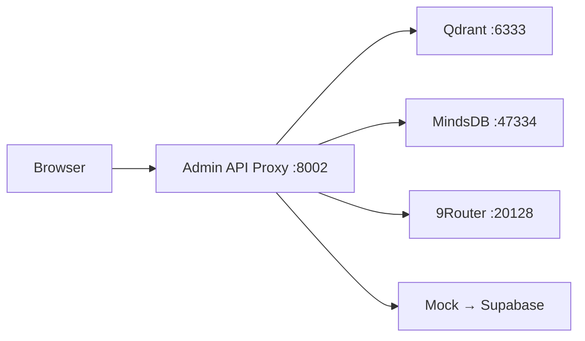

# Admin API Proxy – Reference Documentation

**Stand:** 2026-05-22
**Base URL:** `http://localhost:8002`
**Port:** 8002
**Auth:** `X-NeXify-API-Key` header (shared secret, injected via container env)
**OpenAPI Spec:** `/root/nexifyai-admin/openapi.yaml` (canonical)

## Service overview
The Admin API Proxy is a FastAPI reverse‑proxy that exposes internal services to the Admin Portal frontend without exposing their credentials to the browser.



## Endpoints

### System Health
**`GET /api/v1/health`** – Aggregated health of vector engine, AI engine, AI router.

```json
// 200 OK
{
  "services": {
    "vector_engine":  {"status":"healthy","code":200},
    "ai_engine":      {"status":"degraded","code":500},
    "ai_router":      {"status":"healthy","code":200}
  },
  "timestamp": "2026-05-22T20:30:00.000000"
}
```

### Qdrant – List Collections
**`GET /api/v1/qdrant/collections`** – All Qdrant collections with point count, vector size, distance metric.

```json
// 200 OK
{
  "collections": [
    {"name":"nexifyai_brain","points":20186,"vector_size":4096,"distance":"Cosine"}
  ],
  "total_points": 27989,
  "total_collections": 6
}
```
**502** when Qdrant unreachable.

### MindsDB – SQL Query
**`POST /api/v1/mindsdb/query`** – Execute SQL on MindsDB ML engine.

```json
// Request
{ "query": "SELECT * FROM mindsdb.predictions LIMIT 5" }

// 200 OK → raw MindsDB result
// 502 → MindsDB unreachable
```

### AI Chat – Completion
**`POST /api/v1/ai/chat`** – Chat completion via 9Router (OpenAI‑compatible).

```json
// Request
{
  "model": "ds/deepseek-v4-pro",
  "messages": [{"role":"user","content":"Hello"}],
  "max_tokens": 2048,
  "temperature": 0.7
}

// 200 OK → OpenAI‑style response
{
  "id":"...","object":"chat.completion",
  "choices":[{"index":0,"message":{"role":"assistant","content":"..."},"finish_reason":"stop"}],
  "usage": {"prompt_tokens":10,"completion_tokens":25,"total_tokens":35}
}
```
**502** when 9Router unreachable.

### AI Models – List
**`GET /api/v1/ai/models`** – Static model list (defined in `api_proxy.py`).

```json
// 200 OK
{
  "models": [
    {"id":"ds/deepseek-v4-pro",     "name":"NeXify Pro"},
    {"id":"ds/deepseek-reasoner",    "name":"NeXify Reasoner"},
    {"id":"ds/deepseek-v4-flash",    "name":"NeXify Flash"},
    {"id":"ds/deepseek-v4-pro-max",  "name":"NeXify Ultra"}
  ]
}
```

### CRM – Customers
**`GET /api/v1/crm/customers`** – Mock customer list (will migrate to Supabase).

```json
// 200 OK
{
  "customers": [
    {"id":"C-001","name":"Studienkolleg Aachen","status":"aktiv","projects":3,"revenue":12400}
  ]
}
```

## Security notes
- No external port – bound to internal Docker network only.
- API Key validated on every request (constant‑time comparison).
- AI Router key never exposed to browser – proxied server‑side.
- Token limits enforced server‑side (max 32 768 tokens, default 2048).

---
*Companion reference for the canonical OpenAPI spec at `/root/nexifyai-admin/openapi.yaml`.*