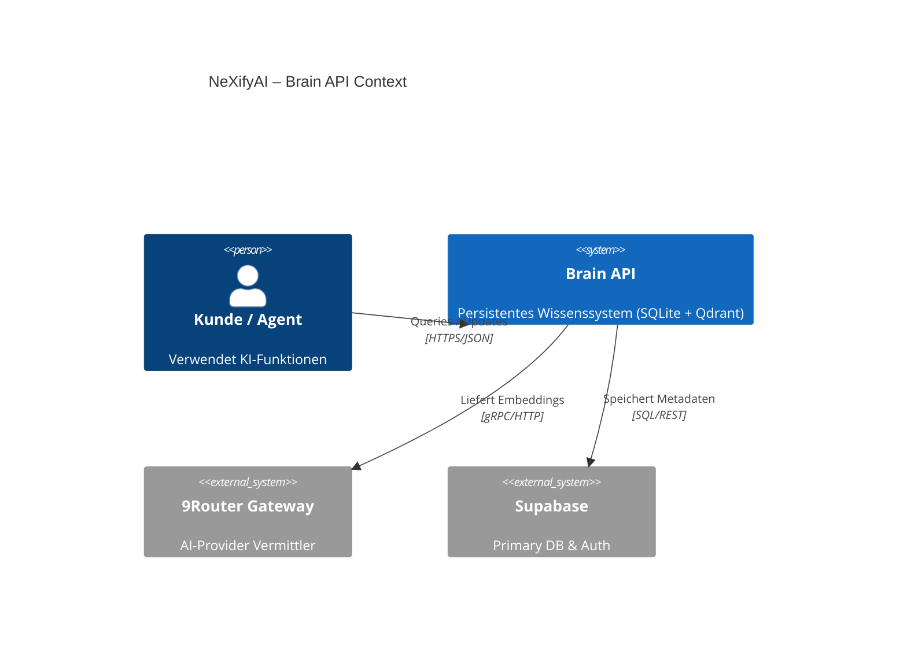
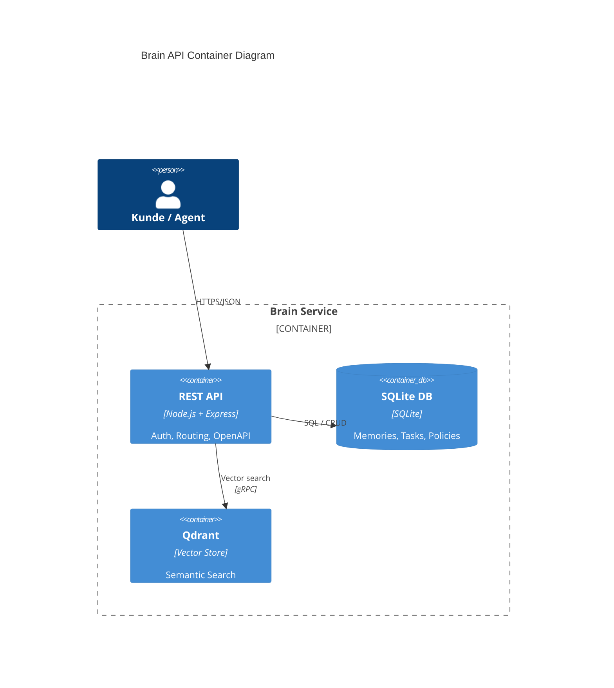
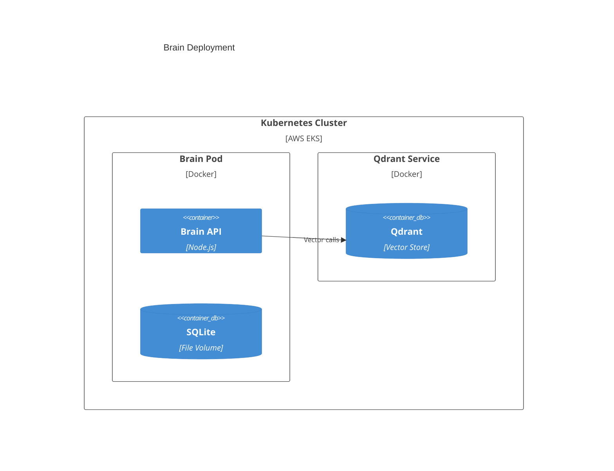

# ADR-101: Brain API Integration

**Status:** proposed
**Datum:** 2026-05-22
**Autor:** NeXifyAI Architecture Team

## Kontext
NeXifyAI verwendet Brain (Qdrant + SQLite) für persistentes Wissensmanagement. Aktuelle IST-Analyse zeigt, dass Brain API (`http://127.0.0.1:8420`) erreichbar, aber kein Auth‑Mechanismus und fehlende Endpunkte (z. B. `/system/status`). Integration muss sicher, skalierbar und mehrmandanten‑fähig sein.

## Entscheidung
Implementierung von **C4‑Context**, **C4‑Container**, **C4‑Component** und **C4‑Deployment** Diagrammen für Brain‑API‑Integration. Authentifizierung via JWT‑Middleware, Role‑Based‑Access und RLS‑ähnliche Policies. Multi‑Tenant‑Isolation über separate SQLite‑DB‑Dateien und Qdrant‑Collections pro Tenant.

## Diagramme
### C4‑Context


### C4‑Container


### C4‑Component (Brain Service)
```mermaid
C4Component
  title Brain Service Components
  Container_Boundary(web, "Brain REST API") {
    Component(auth, "Auth Middleware", "Express JWT", "Validiert JWT, prüft Tenant‑Scope")
    Component(router, "Router", "Express", "Leitet zu Controllers")
    Component(memCtrl, "Memory Controller", "Node", "CRUD für Memories in SQLite")
    Component(vecCtrl, "Vector Controller", "Node", "Such‑/Insert‑Operationen in Qdrant")
    Component(policy, "Policy Engine", "Node", "Write‑Policies, RLS‑Logik")
  }
  Rel(auth, router, "Weiterleitung")
  Rel(router, memCtrl, "Aufruf")
  Rel(router, vecCtrl, "Aufruf")
  Rel(memCtrl, sqlite, "SQL")
  Rel(vecCtrl, qdrant, "gRPC")
  Rel(policy, memCtrl, "Policy‑Check")
  Rel(policy, vecCtrl, "Policy‑Check")
```

### C4‑Deployment


## Konsequenzen
- **Positiv:** Klar definierte Schnittstelle, sichere Auth, Tenant‑Isolation mit separaten DB‑Dateien & Collections.
- **Negativ:** Erhöhte Komplexität im Deployment (mehr Pods, Secret‑Management).
- **Neutral:** Skalierbarkeit über horizontale Pod‑Replikation möglich.

## Nächste Schritte
1. Implementiere JWT‑Middleware, leitet Token‑Claims an Policy‑Engine weiter.
2. Erstelle Qdrant‑Collection‑Naming‑Konvention `brain_{tenantId}`.
3. Ergänze OpenAPI‑Spec für Brain API.
4. Aktualisiere CI‑Pipeline, füge Integrationstests für Auth‑Flow hinzu.
5. Dokumentiere in `/root/sicher-repo/docs/architecture/`.
