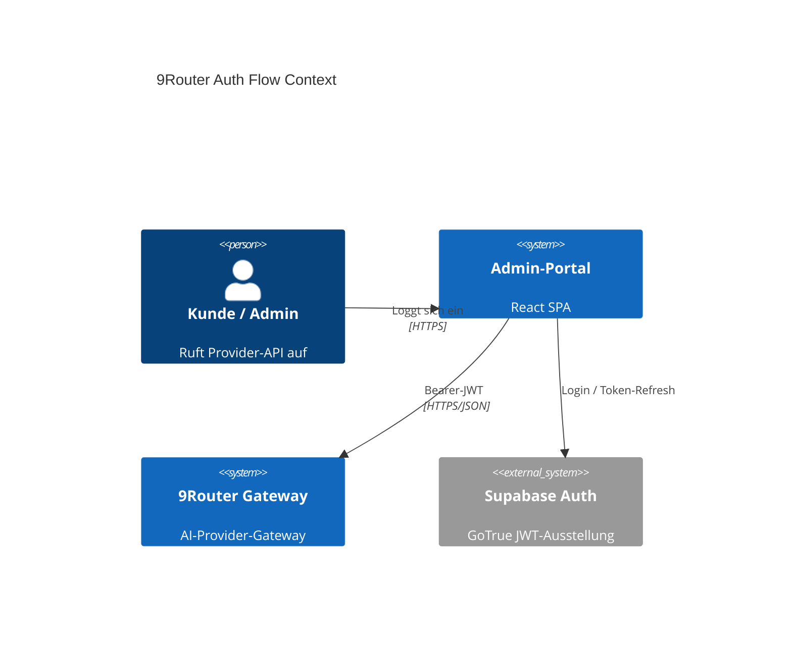
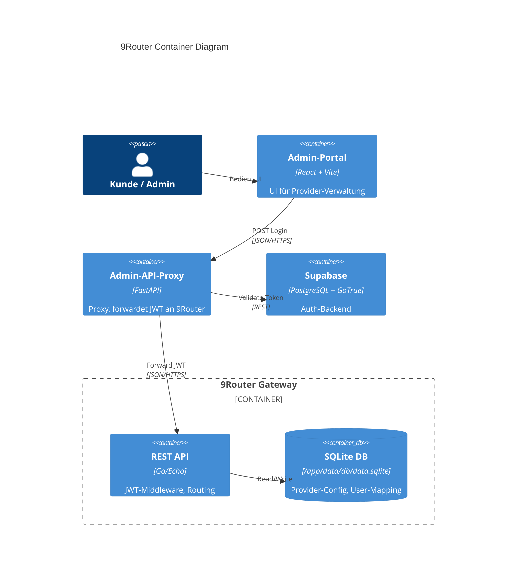
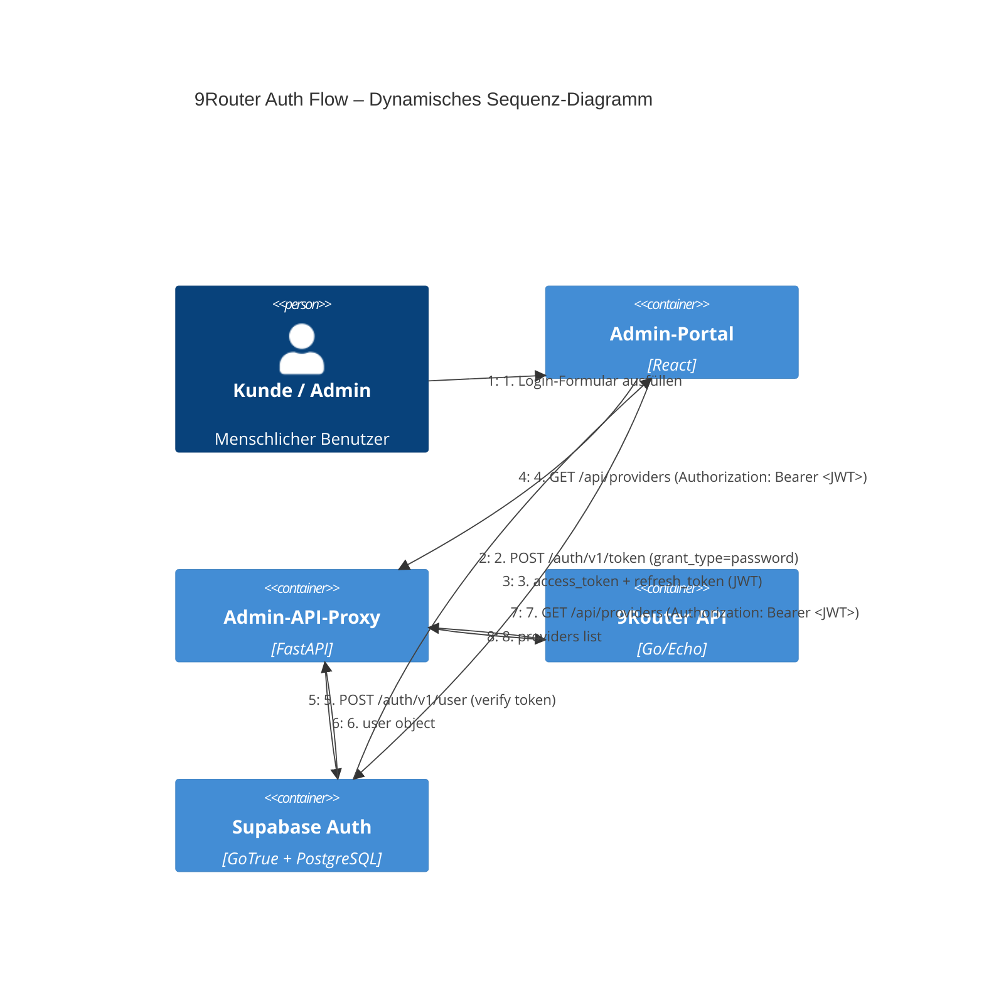
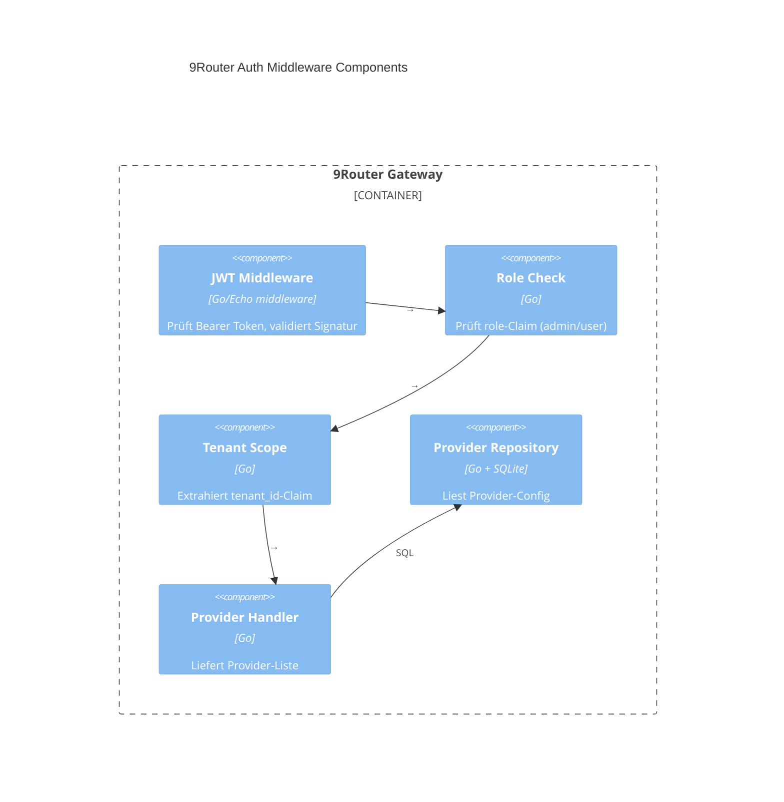

# ADR-102: 9Router Auth-Flow

**Status:** proposed
**Datum:** 2026-05-22
**Autor:** NeXifyAI Architecture Team

## Kontext
9Router (`http://127.0.0.1:20128`) ist AI‑Provider‑Gateway. Aktuell kein JWT‑Auth konfiguriert – `/api/providers` gibt *Unauthorized*, `JWT_SECRET` fehlt in Umgebung. Notwendig: durchgängiger Authentifizierungsfluss von Supabase‑Auth bis 9Router‑API.

## Entscheidung
Implementiere **C4‑Dynamic** (Sequenz‑Diagramm) für 9Router Auth‑Flow. Supabase GoTrue als Identity‑Provider, JWT mit `role`‑Claim, Tenant‑Scope in `tenant_id`‑Claim. 9Router prüft JWT vor jedem API‑Call.

## Diagramme
### C4‑Context

### C4‑Container

### C4‑Dynamic (Sequenz)

### C4‑Component (9Router Auth)

## Konsequenzen
- **Positiv:** Durchgängiger JWT‑Flux, tenant‑scoped API‑Zugriff, nachvollziehbarer Auth‑Flow.
- **Negativ:** Abhängigkeit von Supabase‑Verfügbarkeit für jeden 9Router‑Call; SSO‑Mode nicht getestet.
- **Neutral:** 9Router kann eigene JWT‑Signatur implementieren (z. B. RS256) für Offline‑Validierung.

## Nächste Schritte
1. Setze `JWT_SECRET`, `INITIAL_PASSWORD`, `API_KEY_SECRET`, `MACHINE_ID_SALT` in 9Router‑Umgebung.
2. Konfiguriere JWT‑Middleware in 9Router (`/api/*`).
3. Ergänze Supabase Auth‑Pfad im Admin‑Portal (Login → Token‑Speicherung).
4. Schreibe Integrationstest: Login → Token → Provider‑Abruf.
5. Dokumentiere Postman‑Collection für Auth‑API.
