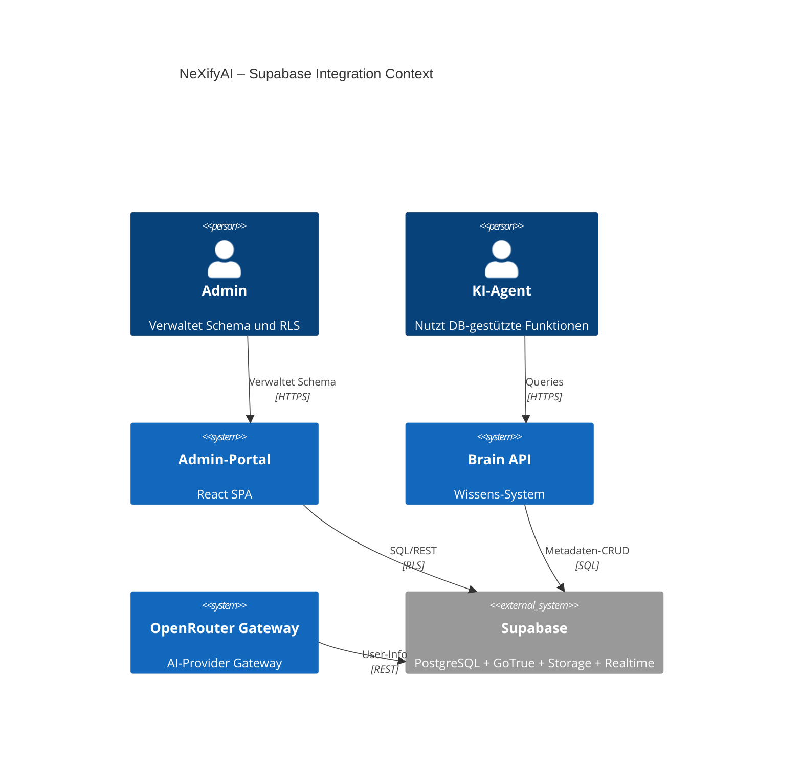
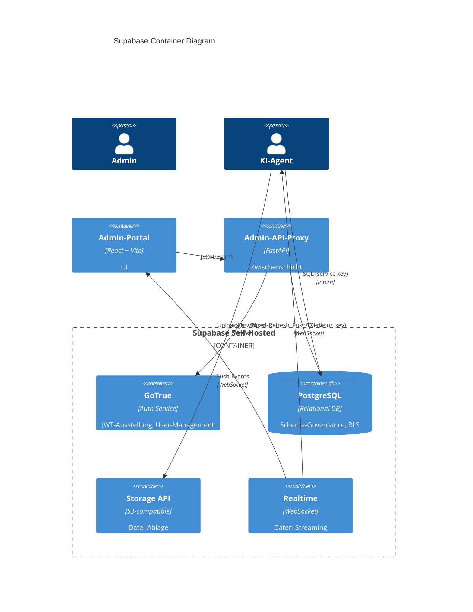
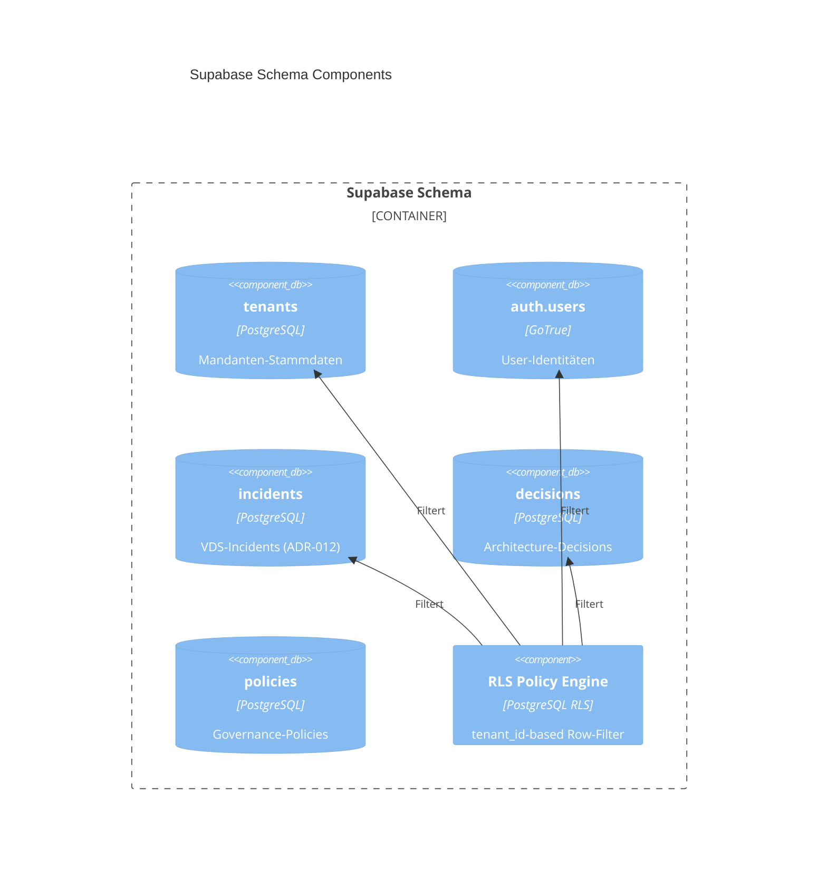
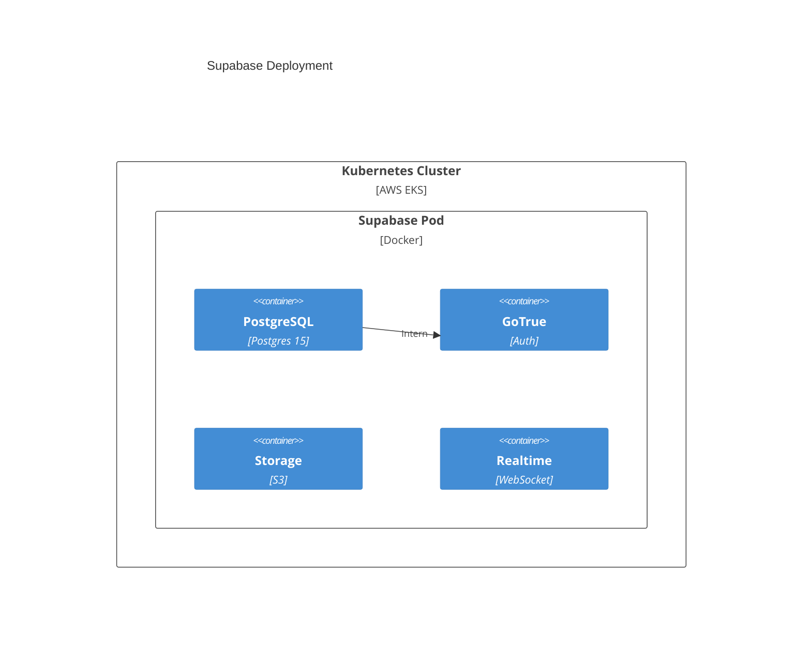

# ADR-103: Supabase Integration

**Status:** proposed
**Datum:** 2026-05-22
**Autor:** NeXifyAI Architecture Team

## Kontext
NeXifyAI hat Supabase als primäre Datenbank (ADR‑002) migriert. IST‑Analyse zeigt: Service‑Role‑Key API‑Call schlägt fehl (`Invalid API key`), keine Schema‑Dokumentation sichtbar. RLS und Multi‑Tenant‑Policies müssen dokumentiert werden.

## Entscheidung
Erstelle C4‑Diagramme (Context, Container, Component) für Supabase‑Integration. Verbinde Supabase mit Multi‑Tenant‑Architektur, Auth (GoTrue), Storage und Realtime‑Push.

## Diagramme
### C4‑Context

### C4‑Container

### C4‑Component (Schema Layer)

### C4‑Deployment

## Konsequenzen
- **Positiv:** Definierte Schema‑Strukturen mit RLS‑Policies sicherstellen Multi‑Tenant‑Isolation; explizite Service/Anon‑Key‑Verwendung klären.
- **Negativ:** RLS‑Debugging komplex; kein automatischer Test.
- **Neutral:** Supabase‑Self‑Hosted gibt volle Kontrolle, aber Maintenance‑Overhead.

## Nächste Schritte
1. Debugge Service‑Role‑Key und stelle korrekte Rolle/Passwort für Admin‑API‑Proxy sicher.
2. Erstelle Migration‑Files für `tenants`, `decisions`, `policies`.
3. Aktiviere RLS auf `auth.users` und `tenants`.
4. Füge `tenant_id`‑Spalte als Pflichtfeld zu bestehenden Tabellen hinzu.
5. Schreibe Audit‑Trigger für Schema‑Änderungen.
