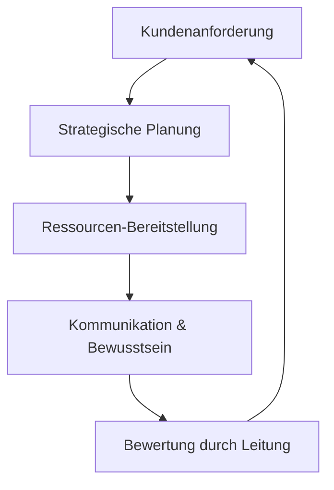

# Qualitätsmanagement-Handbuch (ISO 9001:2015)

**Stand:** 2026-05-30
**Version:** 2.0
**Verantwortlich:** NeXifyAI Product Owner / Pascal Courbois
**Norm:** ISO/IEC 9001:2015 — Qualitätsmanagementsystem
**Geltungsbereich:** NeXifyAI Enterprise Brain v3 Plattform

---

## 1. QM-Politik

Die NeXifyAI-Plattform wird nach folgenden Qualitätsprinzipien entwickelt und betrieben:

1. **Kundenorientierung** — Jede Funktion löst ein echtes Kundenproblem
2. **Prozessorientierung** — Wiederholbare Workflows statt Ad-Hoc-Lösungen
3. **Kontinuierliche Verbesserung** — Lessons Learned + Prevention Rules = Pflicht
4. **Faktenbasierte Entscheidungen** — Health-Score, Metriken, Runtime Evidence
5. **Mitarbeiterbeteiligung** — Agenten-Governance mit klaren Rollen (14 Contracts)

---

## 2. Qualitätsziele

| Ziel | Metrik | Grenzwert | Aktuell | Messung |
|------|--------|-----------|---------|---------|
| Systemverfügbarkeit | Health-Score | >= 90% | **95%** 🟢 | Alle 30 Min |
| Testabdeckung | CI/CD Fail-Rate | <= 5% | **0%** 🟢 | Pro Commit |
| Incident-Response (SEV1) | Reaktionszeit | < 15 Min | Definiert | Postmortem |
| Incident-Response (SEV2) | Reaktionszeit | < 1 Std | Definiert | Postmortem |
| Dokumentation | ADR-Vollstaendigkeit | Aktuell | **33 ADRs** 🟢 | Pro ADR |
| Dokumentation | Compliance-Docs | 100% | **20 Docs** 🟢 | Monatlich |
| Kundenzufriedenheit | Support-Tickets | — | Implementiert | Pro Ticket |
| Fehlerwiederholung | Prevention Rules | 0 Wiederholungen | **11 Regeln** 🟢 | Pro Incident |

---

## 3. Prozesslandschaft (ISO 9001 Cap. 4-10)

### 3.1 Führungsprozesse (Cap. 5, 7, 9)


### 3.2 Kernprozesse (Cap. 8)
```
┌─────────────┐    ┌─────────────┐    ┌─────────────┐    ┌─────────────┐
│  Entwicklung │───→│   Betrieb   │───→│  Kunden-    │───→│  Support &  │
│  (ADR/CI/CD) │    │  (Platform) │    │  Kommunikation│   │  Wartung   │
└─────────────┘    └─────────────┘    └─────────────┘    └─────────────┘
```

### 3.3 Unterstützungsprozesse (Cap. 7)
- Dokumentenlenkung (siehe Abschnitt 4)
- Wissensmanagement (Brain API + Qdrant)
- Infrastruktur (Docker, VPS, Cloudflare)
- Monitoring (Prometheus, Grafana, Health-Score)

### 3.4 Bewertungsprozesse (Cap. 9)
- Health-Score (alle 30 Min)
- CI/CD (pro Commit)
- Enterprise Audit (taeglich)
- Qualitaets-Review (woechentlich)

### 3.5 Verbesserungsprozesse (Cap. 10)
- Lessons Learned (pro Incident)
- Prevention Rules (pro Fehler)
- Postmortem (nach SEV1/SEV2)
- DOS-Update (bei neuer Erkenntnis)

---

## 4. Dokumentenlenkung (ISO 9001 Cap. 7.5)

### 4.1 Dokumenten-Hierarchie
```
Stufe 1: QM-Handbuch (dieses Dokument)
Stufe 2: Prozessbeschreibungen → DOS-Standards (22)
Stufe 3: Arbeitsanweisungen → ADRs, Policies, Runbooks
Stufe 4: Nachweise → CI-Outputs, Audit-Logs, Brain-Memories
```

### 4.2 Dokumenten-Typen

| Typ | Verzeichnis | Versionierung | Pruefung |
|-----|------------|---------------|----------|
| QM-Handbuch | docs/policies/ | v1.0, v2.0, ... | Jaehrlich |
| ADR | docs/adrs/ | ADR-NNN | Pro Entscheidung |
| System-Doku | docs/systems/ | SemVer | Pro Aenderung |
| Policy | docs/policies/ | Datum | Jaehrlich |
| Legal | docs/legal/ | Datum | Nach Bedarf |
| DOS-Standard | docs/agency/ | v1.x, v2.0 | Nach Bedarf |

### 4.3 Dokumenten-Lenkung (Freigabe, Aenderung, Archiv)

| Schritt | Beschreibung | Verantwortlich |
|---------|--------------|---------------|
| Erstellung | Dokument im Repo erstellen | AI-Agent / Admin |
| Pruefung | Fachliche + formelle Pruefung | AI-Architect / AI-Compliance |
| Freigabe | Merge auf main | Pascal (CEO) |
| Veroeffentlichung | Automatisch via CI/CD | GitHub Actions |
| Archivierung | Alte Version im Git-Historie | Automatisch |

---

## 5. Qualitaetspruefung (ISO 9001 Cap. 8.3)

### 5.1 Entwicklungs-Qualitaet (Definition of Done)
Jeder Task durchlaeuft 5 Qualitaetsstufen:

| Stufe | Kriterien | Nachweis |
|-------|-----------|----------|
| **Technisch** | Code, Typecheck, Lint, Tests, Build, Security, CI | CI-Pipeline |
| **Inhaltlich** | Copy-Compiler (8 Stufen), Zielgruppe, Funnel | Copy-Log |
| **Design** | Designsystem-Tokens, Responsive, WCAG, Brand | Design-Log |
| **Tracking** | Events, Payload, Trigger, Automation | Event-Log |
| **Governance** | Doku, ADR, Lessons Learned, Brain-Store | DoD-Log |

Quelle: [DOS Definition of Done](../agency/DOS_DEFINITION_OF_DONE.md)

### 5.2 Qualitaets-Gates (17 Gates)
Vor jedem Task: GATE-01 bis GATE-17 (siehe [DOS Gates](../agency/DOS_GATES.md))

### 5.3 Review-Prozess

| Review-Typ | Ausloeser | Pruefer | Dauer |
|------------|-----------|---------|-------|
| Code-Review | PR erstellt | AI-Architect / AI-Reviewer | < 4h |
| Security-Review | System-Aenderung | AI-Security | < 8h |
| Compliance-Review | Legal-Aenderung | AI-Compliance | < 24h |
| Design-Review | UI-Aenderung | AI-Architect | < 4h |
| Architektur-Review | ADR-Entscheidung | AI-Architect + ADR | < 48h |

---

## 6. Messung, Analyse und Verbesserung (ISO 9001 Cap. 9-10)

### 6.1 Kennzahlen-Übersicht

| Kennzahl | Quelle | Intervall | Grenzwert | Verantwortlich |
|----------|--------|-----------|-----------|----------------|
| Health-Score | health-score.py | 30 Min | >= 90% | NeXifyAI |
| CI-Pass-Rate | GitHub Actions | Pro Commit | >= 95% | AI-QA |
| Offene Incidents | Incident-Register | Taeglich | — | AI-Security |
| Lessons Learned | learning/ | Pro Incident | — | AI-Memory |
| Prevention Rules | learning/ | Pro Fehler | — | AI-Governor |
| Brain Points | brain_api/stats | Taeglich | Steigend | AI-Memory |

### 6.2 Verbesserungszyklus (PDCA)

```
Plan:   Qualitaetsziele definieren → Aufgaben planen
Do:     Aufgaben ausfuehren → CI/CD → Deploy
Check:  Health-Score → CI-Status → Lessons Learned
Act:    DOS-Update → Prevention Rules → Prozess-Anpassung
```

### 6.3 Nichtkonformitaeten und Korrekturmassnahmen (Cap. 10.2)

| Schritt | Beschreibung | Frist |
|---------|--------------|-------|
| Erkennung | Incident oder Audit-Fund | — |
| Bewertung | Schweregrad (SEV1-SEV4) | < 1h |
| Sofortmassnahme | Fix/Rollback/Workaround | < 4h |
| Ursachenanalyse | Root-Cause (5 Whys) | < 48h |
| Korrekturmassnahme | Code-Fix / Prozess-Aenderung | < 1 Woche |
| Wirksamkeitspruefung | Nachkontrolle nach 30 Tagen | 30 Tage |
| Lessons Learned | Prevention Rule + Brain-Eintrag | < 1 Woche |

---

## 7. Audit-Programm (ISO 9001 Cap. 9.2)

| Audit-Typ | Rhythmus | Pruefer | Umfang |
|-----------|----------|---------|--------|
| **Internes System-Audit** | Taeglich (automatisiert) | AI-Auditor | Health-Score, CI/CD, Incidents |
| **Internes Compliance-Audit** | Woechentlich | AI-Compliance | DSGVO, ISO-Vorbereitung |
| **Externes Audit** (geplant) | Jaehrlich | Externer Auditor | ISO 27001-Zertifizierung |

---

## 8. Managementbewertung (ISO 9001 Cap. 9.3)

| Agenda-Punkt | Input | Rhythmus |
|-------------|-------|----------|
| Status letzter Bewertung | Protokoll | Monatlich |
| Qualitaetspolitik-Aenderungen | Markt/Risiko | Bei Bedarf |
| Kennzahlen-Review | Health-Score, CI, Incidents | Taeglich |
| Audit-Ergebnisse | Audit-Log | Woechentlich |
| Kundenfeedback | Support-Tickets | Woechentlich |
| Prozessleistung | Laufzeit, Fehlerraten | Monatlich |
| Korrekturmassnahmen-Status | Prevention Rules | Monatlich |
| Ressourcenbedarf | Infrastruktur, Capacitaet | Monatlich |

---

## 9. Verweise

| Dokument | Ort |
|----------|-----|
| DOS Definition of Done | [DOS_DEFINITION_OF_DONE.md](../agency/DOS_DEFINITION_OF_DONE.md) |
| DOS Gates | [DOS_GATES.md](../agency/DOS_GATES.md) |
| ADR-Verzeichnis | [README.md](../adrs/README.md) |
| ISMS-Rahmendokument | [isms-framework.md](./isms-framework.md) |
| Security Policy | [security-policy.md](./security-policy.md) |
| Test-Suite | [tests/](../../services/api/tests/) |
| Incident Response Plan | [incident-response-plan.md](./incident-response-plan.md) |